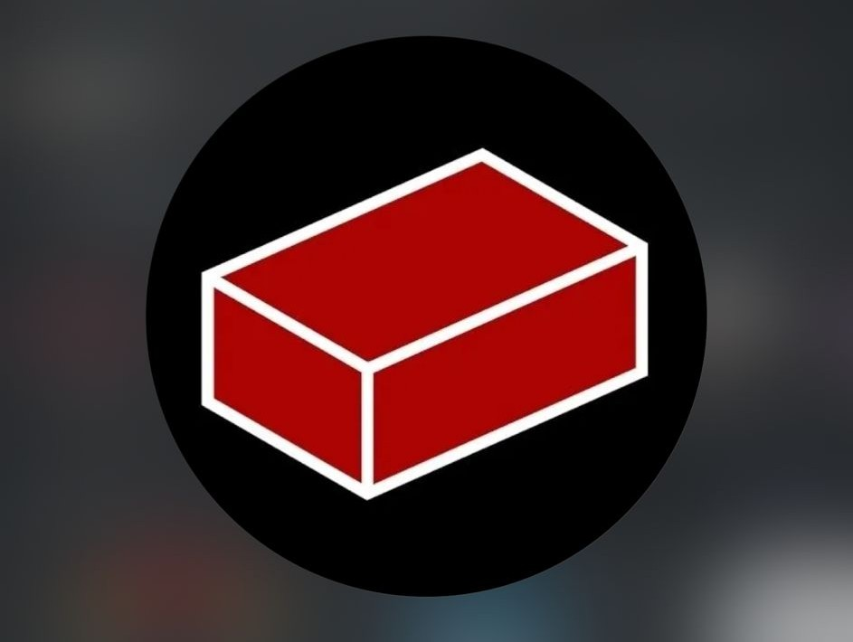
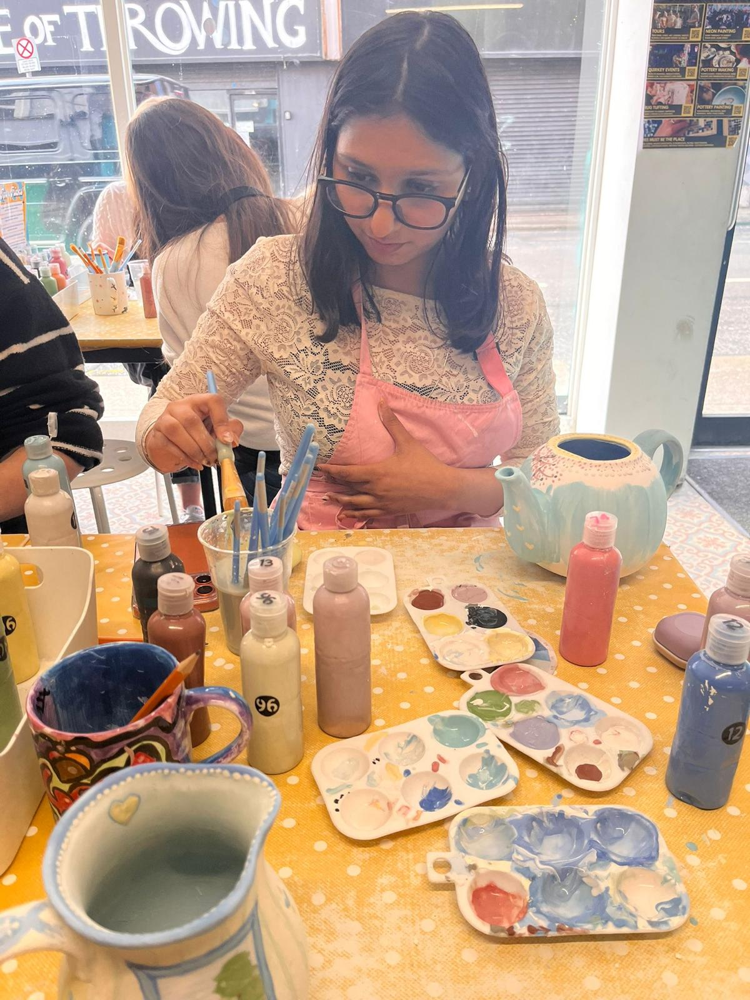

## Personal Introduction

Hello, I am **Esha Esha**, a Business Studies student at **Dublin City University** with a strong passion for business growth, analytics, innovation, and strategy.

My university journey is helping me combine academic learning with practical experience to build a successful international career.

::: {.callout-note}
I believe success comes through discipline, continuous learning, confidence, and creativity.
:::

---

## Education

## Dublin City University

- Degree: Business Studies  
- Current Stage: Year 3  
- Specialisation: Analytics  

### Academic Focus Areas

- Business Analytics  
- Marketing  
- Consumer Behaviour  
- Strategic Management  
- International Business  
- Data Driven Decision Making  

---

## Professional Experience

Alongside university, I have gained part time work experience which has strengthened my practical business skills.

### Workplace Skills Developed

- Customer service excellence  
- Team collaboration  
- Communication skills  
- Handling pressure  
- Time management  
- Professional responsibility  
- Problem solving  

This experience has improved my confidence and readiness for the corporate environment.

---

## Core Skills

::: {.columns}

::: {.column width="50%"}

### Business & Technical Skills

- Business Analytics  
- Excel  
- Power BI  
- Data Visualisation  
- Dashboard Reporting  
- Market Research  
- Strategic Thinking  
- Marketing Analysis  

:::

::: {.column width="50%"}

### Professional Skills

- Communication  
- Leadership  
- Teamwork  
- Problem Solving  
- Adaptability  
- Critical Thinking  
- Presentation Skills  
- Time Management  

:::

:::

---

## Student Life and Activities

At DCU, I actively participate in student communities that support both technical and personal growth.

::: {.columns}

::: {.column width="33%"}

{width="100%" fig-alt="Redbrick Society"}

### Red Brick Society

Coding society where I explore technology, innovation, networking, and problem solving.

**Skills Built**

- Digital mindset  
- Collaboration  
- Technical curiosity  

:::

::: {.column width="33%"}

{width="100%" fig-alt="Fashion Society"}

### Fashion Society

Creativity, confidence, networking, branding, and student events.

**Skills Built**

- Creativity  
- Confidence  
- Presentation  

:::

::: {.column width="33%"}

{width="100%" fig-alt="Rock Climbing"}

### Rock Climbing

Fitness, resilience, teamwork, discipline, and challenge mindset.

**Skills Built**

- Focus  
- Determination  
- Fitness  

:::

:::

---

## Beyond Academics

::: {.columns}

::: {.column width="55%"}

I enjoy activities that help me remain creative, healthy, and disciplined.

### Interests

- Gym training  
- Badminton  
- Pottery  
- Fashion trends  
- Networking  
- Personal development  
- Travel and new experiences  

These hobbies help me maintain a balanced and growth oriented lifestyle.

:::

::: {.column width="45%"}

{width="100%"}

:::

:::

---

## Strength Profile

| Area | Strength | Value |
|------|----------|-------|
| Business | Strategic Thinking | Better decisions |
| Data | Analytics & Reporting | Clear insights |
| People | Communication | Strong teamwork |
| Digital | Modern Tools | Efficiency |
| Growth | Adaptability | Continuous progress |

---

## Career Goal

My goal is to build a successful international career in:

- Business Analytics  
- Consulting  
- Strategic Management  
- Growth Focused Corporate Roles  

I aim to create measurable value for organisations through data driven decisions and innovation.

---

## Connect With Me

### Professional Profiles

- LinkedIn: [View Profile](https://www.linkedin.com/in/esha-2a036532a)

- GitHub: [View Portfolio Code](https://github.com/Esha-Dahiya)

::: {.callout-tip}
I am always open to networking, collaborations, and career opportunities.
:::
