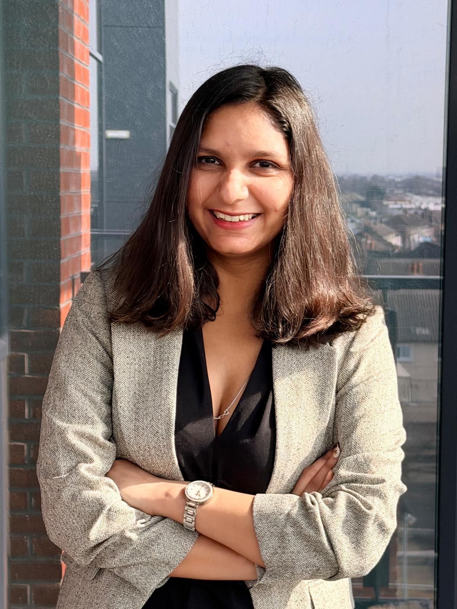
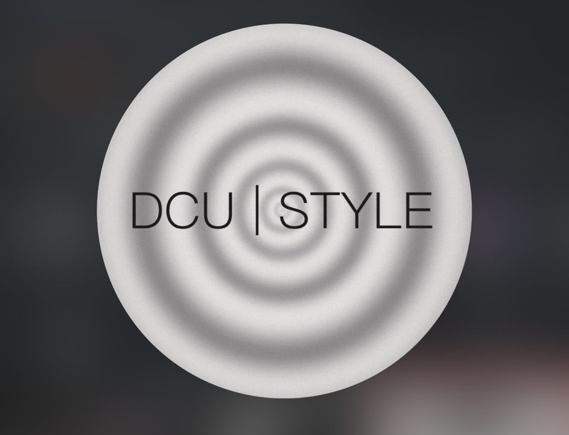
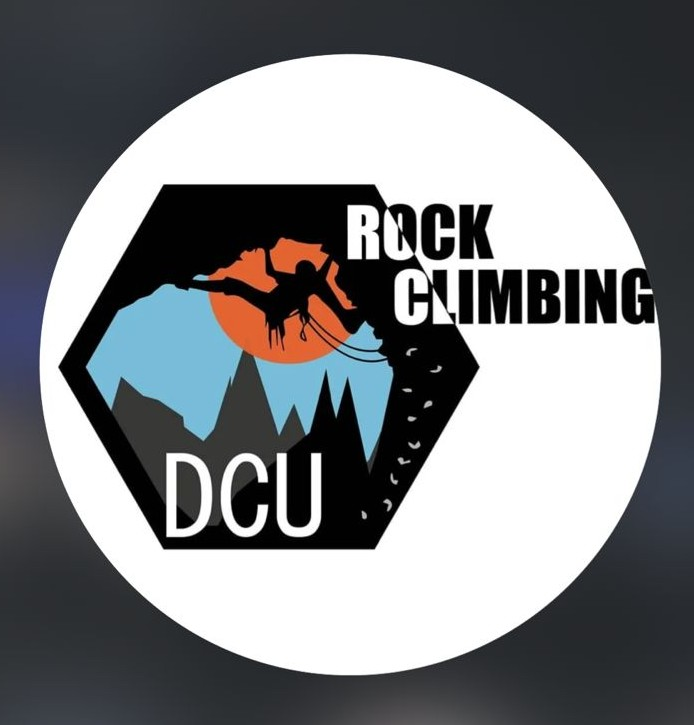

::: {.hero-wrapper}

::: {.columns .v-center}

::: {.column width="40%"}

{.hero-image}

:::

::: {.column width="60%"}

# Hi, I'm Esha Esha

## Business Studies Student at Dublin City University

### Future Business Analyst | Strategic Thinker | Global Mindset

I am a motivated and ambitious business student with strong interests in analytics, strategy, marketing, innovation, and international growth.

My journey combines academic excellence, practical work experience, and active student life in Ireland.

I aim to build an international career where business intelligence, creativity, and leadership create measurable value for organisations.

[Download CV](cv/Esha_CV.pdf){.btn .btn-primary .btn-lg target="_blank"}
[View Projects](projects/index.qmd){.btn .btn-outline-dark .btn-lg}
[Contact Me](contact.qmd){.btn .btn-success .btn-lg}

:::

:::

:::

---

## Highlights

::: {.columns}

::: {.column width="25%"}

<h2>0+</h2>

Countries Experience

:::

::: {.column width="25%"}

<h2>0+</h2>

Professional Skills

:::

::: {.column width="25%"}

<h2>0+</h2>

Student Societies

:::

::: {.column width="25%"}

<h2>0</h2>

Analytics Specialisation

:::

:::

---

## Why Choose Me

::: {.columns}

::: {.column width="33%"}

### Data Driven

I enjoy transforming raw information into meaningful insights that support smarter business decisions and growth.

:::

::: {.column width="33%"}

### Creative Thinker

I combine business logic, communication, presentation, and innovative problem solving ideas.

:::

::: {.column width="33%"}

### Global Mindset

My experience across India and Ireland has built adaptability, confidence, and cultural awareness.

:::

:::

---

## Student Life at DCU

At Dublin City University, I actively participate in communities that support learning, leadership, confidence, and networking.

::: {.columns}

::: {.column width="33%"}

{width="100%"}

### Red Brick Society

Coding society where I explore technology, innovation, and problem solving.

:::

::: {.column width="33%"}

{width="100%"}

### Fashion Society

Creativity, confidence, networking, student events, and branding exposure.

:::

::: {.column width="33%"}

{width="100%"}

### Rock Climbing

Fitness, resilience, teamwork, challenge mindset, and confidence building.

:::

:::

---

## Current Interests

::: {.columns}

::: {.column width="33%"}

### Business Analytics

Dashboards, KPI tracking, forecasting, reporting, and business intelligence.

:::

::: {.column width="33%"}

### Marketing Trends

Consumer behaviour, branding strategy, digital growth, and market positioning.

:::

::: {.column width="33%"}

### Innovation

AI, automation, transformation strategy, and future business models.

:::

:::

---

## Beyond Academics

::: {.columns}

::: {.column width="55%"}

I strongly believe personal growth happens beyond the classroom.

I enjoy gym training, badminton, pottery, fashion trends, and continuous self development.

These activities help me stay disciplined, creative, confident, and healthy.

Gym training has taught me consistency, resilience, and long term improvement.

Badminton improves concentration, energy, and fast decision making.

Pottery is one of my favourite hobbies because it develops patience, creativity, and attention to detail.

Fashion and styling improve confidence, presentation, and awareness of modern trends.

Balancing academics with hobbies helps me perform better and think more clearly.

:::

::: {.column width="45%"}

{width="100%"}

:::

:::

---

## My Journey

| Stage | Focus Area | Key Development | Outcome |
|---|---|---|---|
| India Experience | Early learning and exposure | Adaptability and communication | Strong foundation |
| Professional Work Roles | Practical workplace skills | Teamwork and responsibility | Real world confidence |
| Dublin City University | Academic excellence | Business knowledge and networking | Global education |
| Analytics Focus | Year 3 specialisation | Data thinking and reporting | Career direction |
| Global Career Vision | Long term ambition | Leadership and international mindset | Future success |

---

## Connect With Me

- LinkedIn: [linkedin.com/in/esha-2a036532a](https://www.linkedin.com/in/esha-2a036532a)

- GitHub: [github.com/Esha-Dahiya](https://github.com/Esha-Dahiya)

::: {.callout-tip}
Open to internships, graduate roles, networking, and collaboration opportunities.
:::

